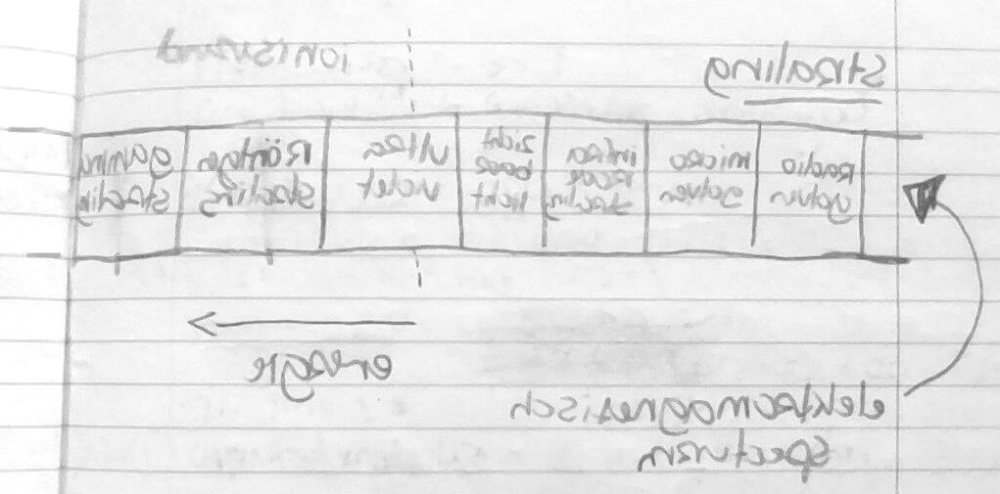
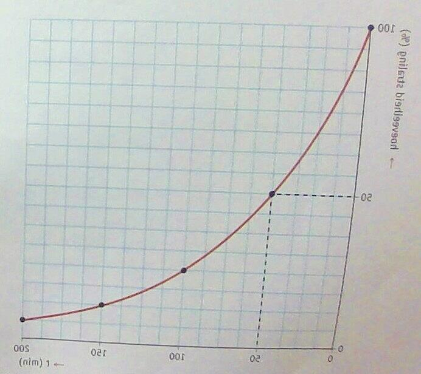
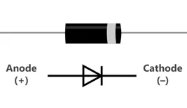
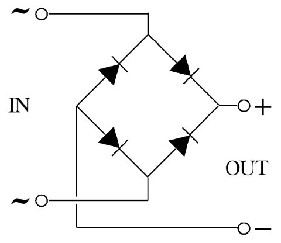

# Straling en schakelingen

Dit is een samenvatting van H5 en H6 van NOVA. Geschreven door Robin Boers voor toetsweek 4 van leerjaar 3VWO.

## Straling

De lichtsnelheid (c) in vacuüm en lucht is:

```
3 * 10⁸ m/s
```

_Als je rekent met de lichtsnelheid gebruik je `s = c * t` ipv `s = v * t`._

### EM-spectrum

Het elektromagnethisch spectrum ziet er zo uit:



Hoe rechtser in het spectrum, hoe meer energie de straling meedraagt. Hoe meer energie, hoe schadelijker. Ioniserende straling is schadelijk, en begint ergens bij UV-straling. 

### Golven

Golven hebben 3 eigenschappen:

- **Frequentie** (f): aantal trillingen per seconde in Hz
- **Golflengte** (λ): lengte van 1 trilling in m
- **Golfsnelheid** (v): snelheid waarmee de golf zich voortbeweegt. _Voor EM-straling is dat de lichtsnelheid (c)._

Hierbij geld:
```
v = f * λ
```

### Fotonen

Straling bestaat ook uit deeltjes, en die deeltjes noemen we fotonen (want ook *foto*synthese en *foto*lyse). 

- geen massa
- wel energie
- bewegen met lichtsnelheid (c)

Je kan de energie van een foton (E<sub>f</sub>) uitrekenen met de volgende formule:

```
Ef = h * f
```

Waarbij geldt:

- E<sub>f</sub> = fotonenergie in Joule (J)
- h = de constante van Planck in Jouleseconde (J*s)
- f = de frequentie in Hz

_De constante van Planck krijg je op de toets._

## Licht

Er zijn 3 verschillende lichtbundels:

- Divergent: de stralen bewegen uit elkaar
- Convergent: de stralen bewegen naar elkaar toe (en raken elkaar in een brandpunt)
- Evenwijdig: stralen blijven evenwijdig aan elkaar


### Lenzen

Een lens is een gebogen stukje doorzichtig materiaal die de richting van lichtstralen kan veranderen.

Je hebt 2 soorten:

- Positieve lenzen (ookwel bolle lenzen)
- Negatieve lenzen (ookwel holle lenzen)

#### Resultaten bij verschillende lichtbundels

Positieve lens:

- Evenwijdig wordt convergent
- Convergent wordt convergenter
- Divergent bij een sterke lens wordt convergent
- Divergent bij een zwakke lens wordt minder divergent

Negatieve lens:

- Evenwijdig wordt divergent
- Divergent wordt divergenter
- Convergent bij een sterke lens wordt divergent
- Convergent bij een zwakke lens wordt minder convergent

_Hoe dichterbij het brandpunt, des te sterker de lens._

### Brandpunt

Het brandpunt (F) ligt op de as van het optisch midden op de brandpuntsafstand (f), en is de plek waar de lichtstralen zich kruisen.

Bij een positieve lens is dat waar de lichtstralen na de lens terechtkomen.

Bij een negatieve lens is dat waar de lichtstralen van de divergente bundel vandaan _lijken_ te komen (achter de lens dus).

Er is altijd een ander brandpunt op dezelfde afstand (f) van de lens aan de andere kant.

_f is bij een negatieve lens ook negatief!_

### Beelden

Beelden hebben de volgende eigenschappen:

- Als ze aan de andere kant van de lens staan zijn ze omgekeerd
- Ze kunnen verkleind over vergroot zijn
- Reëel of virtueel: een virtueel beeld staat aan dezelfde kant van de lens als het voorwerp.

Als je een camera scherpstelt stem je de beeldafstand en voorwerpsafstand op elkaar af (zodat het beeld precies op de sensor van de camera valt). Bij elke voorwerpsafstand hoort maar één beeldafstand.

Je kan beelden tekenen met constructiestralen. Deze zijn

#### Constructiestralen bij een positieve lens

- Loodrecht op de lens -> door het brandpunt
- Door het optisch midden -> gewoon dezelfde kant op na de lens
- Door het brandpunt aan deze kant -> loodrecht op de lens

#### Constructiestralen bij een negatieve lens

- Loodrecht op de lens -> uit het brandpunt aan de voorwerpskant van de lens
- Door het optisch midden -> gewoon dezelfde kant op na de lens
- Richting brandpunt aan beeldzijde -> loodrecht op de lens

## Röntgenstraling

Als er straling op een voorwerp valt kunnen er drie mogelijke dingen gebeuren:

- **Transmissie**: de straling gaat door het voorwerp heen
- **Absorptie**: het voorwerp absorbeert de straling
- **Relectie**: het voorwerp kaatst de straling terug

Bij het maken van een röntgenfoto wordt een röntgenbron en een detector gebruikt. Je legt het voorwerp waarvan je een foto wil maken (bijv. de patient) op de detector en je stuurt straling uit de bron naar de detector. De botten van de patient zullen de straling absorberen, terwijl de omliggende weefsels het door zullen laten. Daardoor ziet de detector de schaduw van de botten, die vervolgens kan worden opgeslagen als foto.

Röntgenstraling is ioniserende straling, straling die voor mensen gevaarlijk is. Je moet er dus niet teveel aan blootgesteld zijn, want het kan leiden tot kanker. Als je blootgesteld bent aan straling kan je de equivalente dosis bepalen. Dat is de mate aan biologische schade aan weefsels die je hebt opgelopen. Je meet dit in Sv.

Bronnen van straling in het dagelijks leven zijn:

- Bodem/bouwmaterialen
- Medische straling
- Kosmische straling
- Radon?
- Straling uit voedsel

Met de halveringsdikte (d<sub>1/2</sub>) kan je meten hoeveel straling een voorwerp absorbeert. Als het even dik is als 1d<sub>1/2</sub>, laat het de helft van de straling door. Als het 2d<sub>1/2</sub> dik is, laat het maar 1/4 van de straling door etc.

## Radioactiviteit

Objecten die spontaan ioniserende straling uitzenden noem je radioactief. Je hebt 2 soorten:

- Natuurlijk radioactief, die gewoon in de natuur voorkomen.
- Kunstmatig radioactief, die door natuurkundigen worden gemaakt.

3 soorten straling:

- Deeltjesstraling: stroom deeltjes met een hele hoge snelheid
	-	Alfastraling en bètastraling. Alfastraling heeft grotere en zwaardere deeltjes
- Gammastraling: EM-straling met kleine golflengte. Zelfde als röntgen, maar ioniserender, en dus gevaarlijker.

### Halveringstijd

De radioactieve stof wordt bij het uitzenden van straling omgezet in een andere stof. Na een tijd is de helft van de oorspronkelijke stof weg. Die tijd noemen we de halveringstijd, en kan rangen van miljarden jaren tot uren.

Je kan de halveringstijd uit een grafiek bepalen door op de de as met hoeveelheid straling te kijken en daar 50% te pakken.



### Dracht

Deeltjesstraling is gevaarlijk omdat het met moleculen botst en daarbij de moleculen beschadigd.

Ze worden hierbij wel afgeremd (de deeltjes). De maximale lengte die ze kunnen afleggen binnen een materiaal noemen we de dracht (dit verschilt per materiaal en straling).

Het doordringend vermogen is hoe goed straling door materialen kan. Gammastraling heeft geen dracht, want wordt alleen verzwakt. Er is een betonnen muur nodig om het voldoende te verzwakken zodat het veilig is voor mensen.

### Bestraling en besmetting

Als je in contact komt met radioactieve objecten kan je lichaam beschadigd worden door de ioniserende gammastraling. Dit noemen we bestraling.

Als je echter radioactieve deeltjes inademt, radioactief besmet water drinkt of op een andere manier radioactief materiaal binnenkrijgt word je ook een bron van straling. Dit noemen we besmetting.

### Radiotherapie

Gammastraling kan worden gebruikt om tumorcellen te doden. Je moet heel gericht bestralen, want anders worden ook gezonde cellen gedood, en dat risico moeten we minimaliseren.

#### Uitwendige bestraling

De bron bevind zich buiten de patient, en wordt om de patient heen gedraaid zodat de straling niet steeds van dezelfde kant komt. Dit is een vorm van besmetting.

#### Inwendige bestraling

Bij inwendige bestraling wordt een radioactief staafje dat alfa- en bètastraling uitzend in de tumor geimplanteert. Na de behandeling wordt deze weer verwijderd.

## Lading

Voorwerpen kunnen positief of negatief geladen zijn. De lading bepaalt of ze andere voorwerpen aantrekken of afstoten. Als een voorwerp neutraal (de meeste voorwerpen) is heeft het evenveel positieve als negatieve lading. 

De lading van 1 elektron is:
```
-1.6 * 10⁻¹⁹ C
```

Als de lading beweegt, omdat een geladen voorwerp een ander voorwerp aanraakt onstaat een elektrische stroom. Deze bestaat uit een bewegende stroom (meestal elektronen) die elektrische energie met zich meedragen.

De lading (Q) meten we in coulomb (C).

De stroomsterkte (I) is de hoeveelheid lading die per seconde langs een punt in de stroomkring stroomt. We meten dit in C/s of A, waarbij:

```
1 C/s = 1 A
en 
I = Q/t
```

Spanning (U) is de hoeveelheid energie die de lading meekrijgt of afgeeft tussen twee punten in een schakeling (daarom plaatsen we de spanningsmeter buiten de stroomkring). We meten dit in J/C of V, waarbij:

```
1 J/C = 1V
```

Om het makkelijker te maken:

- **Elektronen (=lading)**: vrachtwagens
- **Stroomsterkte**: hoeveelheid vrachtwages die langskomen
- **Spanning**: de hoeveelheid energie de vrachtwages meedragen


## Weerstand

De weerstand (R) geeft aan hoeveel spanning er nodig is om een stroomsterkte van 1 A te krijgen, met andere woorden: hoe goed een apparaat of materiaal stroom tegenhoud. We meten dit in V/A of ohm (Ω), waarbij:

```
1 V/A = 1 Ω
en
R = U/I
```

Een (ohmse) weerstandje is een onderdeeltje waarbij de weerstand constant is. Je tekent ze als een rechthoekje met een R erin in een schakeling. 

In een I,U-diagram:

- Een rechte lijn betekent een constante weerstand
- Hoe steiler, hoe kleiner de weerstand

Voor de meeste materialen geld dat als de temperatuur hoger is, de weerstand ook groter is. Weerstandjes zijn gemaakt van een materiaal waarbij de weerstand ondanks de temperatuur gelijk blijft.

De weerstand in een draad hangt af van:

- De opp. dwarsdoorsnede (A) in m² (waarbij `A = π * r²`)
- De lengte (l) in m
- De soortelijke warmte van het materiaal (ρ) in Ω∙m

```
R = (ρ * l) / A
```

_Let op: de soortelijke warmte voor materialen krijg je op de toets. Je hoeft ze niet uit je hoofd te leren._

## Serie en parallel

### Weerstanden in serie

R<sub>tot</sub> = R₁ + R₂ ...  
I<sub>tot</sub> = I₁ = I₂ ...  
U<sub>bron</sub> = U₁ + U₂ ....

### Weerstanden in parallel

I<sub>tot</sub> = I₁ + I₂ ...  
U<sub>bron</sub> = U₁ = U₂ ....
1/R<sub>tot</sub> = 1/R₁ + 1/R₂ ...  

R<sub>tot</sub> is in parallel altijd kleiner dan de kleinste weerstand.

## Diode

Een diode laat de stroom maar in één richting door. Een diode heeft een doorlaatrichting (de driehoek) en een sperrichting (de muur). 



In de doorlaatrichting heeft de diode (bijna) geen weerstand. In de sperrichting is deze enorm groot. 

_In een parallel schakeling hoef je de weerstand van een diode niet mee te rekenen voor R<sub>tot</sub>, want R<sub>diode</sub> is verschrikkelijk groot, en 1/R<sub>diode</sub> is dus zo klein dat het verwaarloosbaar is._

### Toepassingen

1. Bescherming tegen het verkeerd aansluiten van een spanningsbron.
2. Een LED (light emitting diode) als gebruikt voor licht.
3. Een gelijkrichter om wisselspanning in gelijkspanning om te zetten (bijv. in telefoon of laptopoplader).


_Energiestroomdiagram van een gelijkrichter_